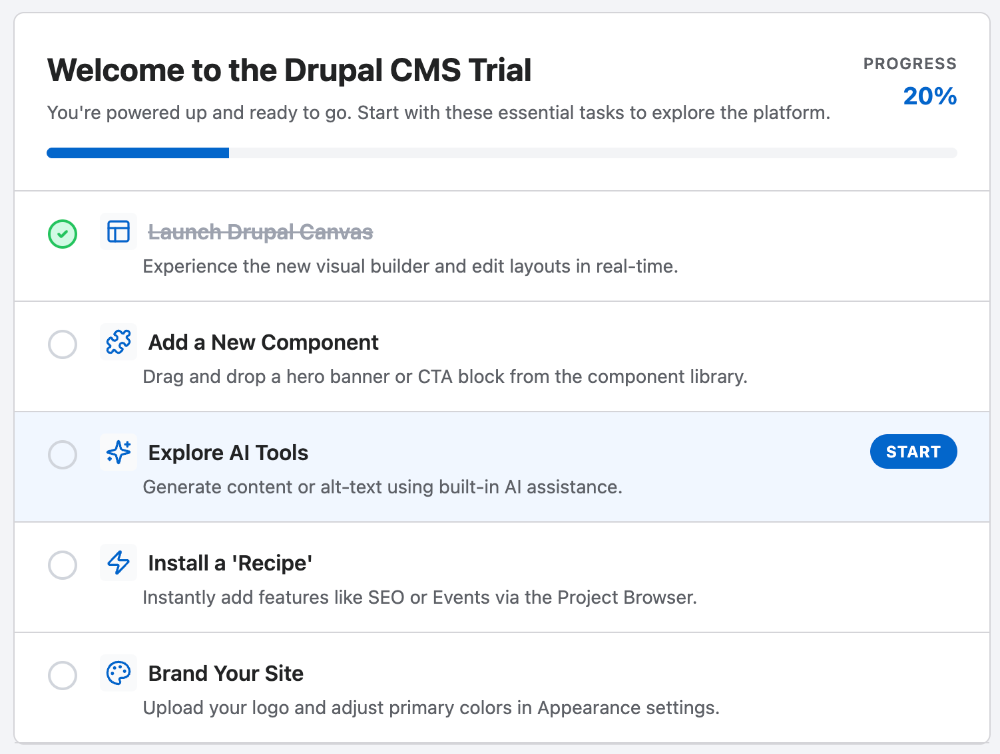

# Acquia Trials Checklist
Provides a checklist of tasks to complete to familiarize a user with Drupal CMS as a block.

Edit the items in the checklist by editing `checklist_items.yml` in the module's `config/install` directory.

