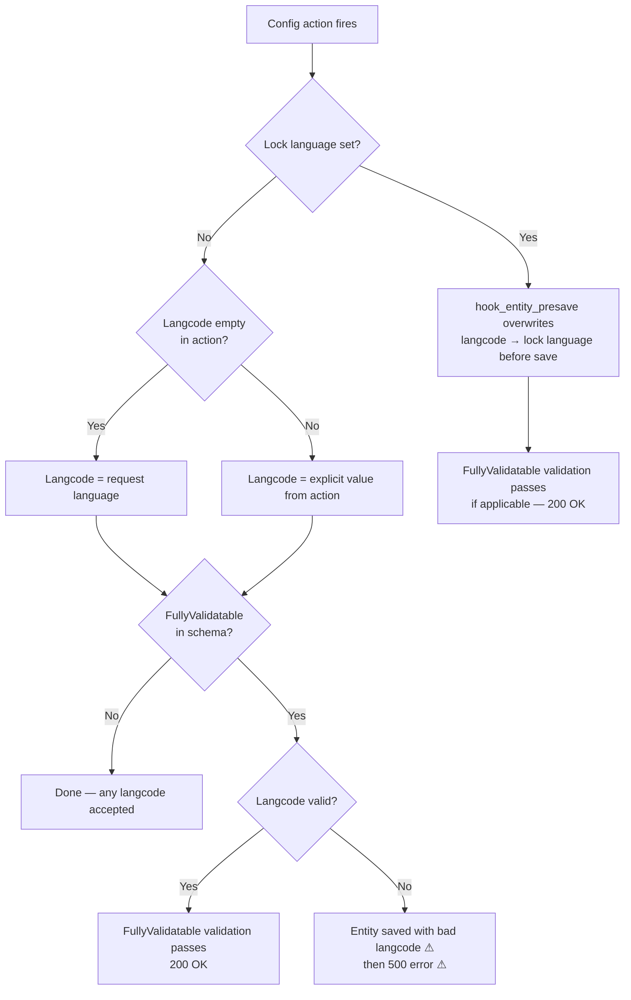

# Config actions

Config actions (such as `createOrUpdate`) create or modify config entities
programmatically. This page covers how langcodes are determined for entities
created via config actions, both standalone and inside recipes.

## How Drupal determines langcode without a lock

Without a lock, config actions use the current request language as the langcode
when no explicit value is given. If the action specifies a langcode explicitly,
that value is used as-is.

`ConfigActionManager` validates `FullyValidatable` entity types after each
action. An entity type without the `FullyValidatable` schema marker is never
validated, so any langcode value is accepted silently.

## How this module enforces the lock

`hook_entity_presave` intercepts every config entity save and overwrites the
`langcode` to the lock language. This fires before `ConfigActionManager`'s
validation step, so:

- Invalid langcodes (empty string, unknown codes) are normalized before the save
  takes place.
- The saved entity always has a valid langcode.
- `FullyValidatable` validation passes.

Config actions inside recipes are handled by `hook_entity_presave` and **not**
by the `RecipeAppliedEvent` subscriber. The subscriber only processes config
names from the recipe's static config storage (files in `config/`); entities
created at runtime by actions are not in that list.

## Outcome matrix

The test module ships two entity types:

- `lock_test_always_valid` — has `FullyValidatable` in its schema; validated
  after each action.
- `lock_test_maybe_invalid` — no `FullyValidatable`; never validated.

In the tables below, `xx` is the request language, `yy` is a known installed
language that is neither the request language nor the site default, and `de` is
the lock language used in locked scenarios.

### Standalone config action — no lock

| langcode in action | Entity type | Saved langcode | Result |
|---|---|---|---|
| _(none — request lang `xx`)_ | always_valid | `xx` | 200 |
| `yy` (explicit, known lang) | always_valid | `yy` | 200 |
| _(empty)_ | always_valid | _(empty)_ ⚠ | 500 ⚠ — fails `FullyValidatable`, entity kept with bad langcode |
| `zz` (unknown lang) | always_valid | `zz` ⚠ | 500 ⚠ — fails `FullyValidatable`, entity kept with bad langcode |
| _(none — request lang `xx`)_ | maybe_invalid | `xx` | 200 |
| `yy` (explicit, known lang) | maybe_invalid | `yy` | 200 |
| _(empty)_ | maybe_invalid | _(empty)_ ⚠ | 200 ⚠ — no `FullyValidatable`, bad langcode silently kept |
| `zz` (unknown lang) | maybe_invalid | `zz` ⚠ | 200 ⚠ — no `FullyValidatable`, bad langcode silently kept |

⚠ Invalid or empty langcode persists in storage — either because `FullyValidatable`
validation fires after the save (leaving the entity in the database with the bad
langcode before aborting with 500), or because `maybe_invalid` has no validation
at all and the bad value is silently accepted.

### Standalone config action — lock = `de`

| langcode in action | Entity type | Saved langcode | Result |
|---|---|---|---|
| _(none — request lang `xx`)_ | always_valid | `de` | 200 |
| `yy` (explicit) | always_valid | `de` | 200 |
| _(empty)_ | always_valid | `de` | 200 — lock normalizes before save |
| `zz` (unknown lang) | always_valid | `de` | 200 — lock normalizes before save |
| _(none — request lang `xx`)_ | maybe_invalid | `de` | 200 |
| `yy` (explicit) | maybe_invalid | `de` | 200 |
| _(empty)_ | maybe_invalid | `de` | 200 — lock normalizes before save |
| `zz` (unknown lang) | maybe_invalid | `de` | 200 — lock normalizes before save |

### Config actions inside a recipe — no lock

The same rules apply as standalone. The recipe subscriber does not re-process
action-created entities; `hook_entity_presave` handles them at save time.

| Entity | Action langcode | Saved langcode |
|---|---|---|
| `lock_action_always_valid` | _(none — request lang `xx`)_ | `xx` |
| `lock_action_always_valid_other` | `yy` (explicit, known lang) | `yy` |
| `lock_action_maybe_invalid_missing` | _(none — request lang `xx`)_ | `xx` |
| `lock_action_maybe_invalid_empty` | _(empty)_ | _(empty)_ ⚠ — no validation, bad langcode silently kept |
| `lock_action_maybe_invalid_unknown` | `zz` (unknown lang) | `zz` ⚠ — no validation, bad langcode silently kept |
| `lock_action_empty` | _(empty)_ | _(empty)_ ⚠ — then 500 ⚠, entity kept with bad langcode |
| `lock_action_unknown` | `zz` (unknown lang) | `zz` ⚠ — then 500 ⚠, entity kept with bad langcode |

### Config actions inside a recipe — lock = `de`

| Entity | Action langcode | Saved langcode |
|---|---|---|
| `lock_action_always_valid` | _(none — request lang `xx`)_ | `de` |
| `lock_action_always_valid_other` | `yy` (explicit) | `de` |
| `lock_action_maybe_invalid_missing` | _(none — request lang `xx`)_ | `de` |
| `lock_action_maybe_invalid_empty` | _(empty)_ | `de` — lock normalizes before save |
| `lock_action_maybe_invalid_unknown` | `zz` (unknown lang) | `de` — lock normalizes before save |
| `lock_action_empty` | _(empty)_ | `de` — lock normalizes before save |
| `lock_action_unknown` | `zz` (unknown lang) | `de` — lock normalizes before save |

## Flow diagram

## Related pages

- [UI forms](ui-forms.md) — form-based config entity creation
- [Recipes](recipes.md) — direct config files and extension installs via recipes
- [Module install](module-install.md) — module install langcode behavior
