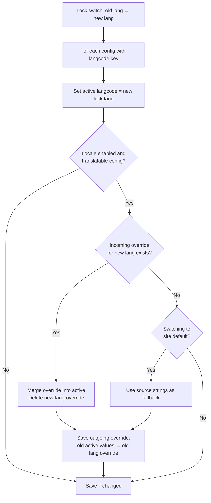

# Lock switch lifecycle

When the lock language is changed via the settings form, a batch rewrites all
active configuration to the new lock language. This page explains what happens
to config langcodes and locale translation overrides across a full language
switch cycle, both with and without the locale module.

## Without locale: langcode-only rewrite

Without locale, `updateConfigForLockedLanguageSwitch()` only rewrites the
`langcode` key. There are no translation overrides to swap, so the active
config values (such as the content type `name`) are never touched. Each switch
simply stamps the new lock language onto every config object that has a
`langcode` key.

### EN → XX → YY → EN round-trip (no locale)

| Step | `node.type.lock_lifecycle` langcode | `node.type.lock_lifecycle_ui` langcode |
|---|---|---|
| Initial (lock = none) | `en` | `en` |
| EN → XX | `xx` | `xx` |
| XX → YY | `yy` | `yy` |
| YY → EN | `en` | `en` |

Both extension-managed config (`node.type.lock_lifecycle`) and UI-created config
(`node.type.lock_lifecycle_ui`) follow the lock at every step. No config values
(such as `name`) are ever modified — only `langcode`.

## With locale: four-step rewrite including override swap

With locale enabled, `updateConfigForLockedLanguageSwitch()` processes each
config object in four steps:

1. **Update active langcode** — sets `langcode` to the new lock language.
2. **Consume incoming override** — if a translation override exists for the new
   lock language, deep-merges those translatable values into active config and
   deletes the override. For locale-tracked config, uses locale's stored map;
   for UI-created config, falls back to schema-based extraction.
3. **Save outgoing override** — saves the translatable parts of the old active
   config as an override for the old lock language. For shipped config, uses
   locale's algorithm; for UI-created config, uses schema-based extraction.
4. **Fallback for switching to default** — if switching to the default language
   and no incoming override exists, falls back to the source strings from
   locale's install storage (for shipped config) or from the config schema's
   `description` defaults (for UI-created config).

Both shipped config (tracked in locale's install storage) and UI-created config
(not tracked in locale) follow the same four-step process, using schema-based
extraction when locale's translatable map is unavailable.

## Prerequisites for the locale examples

The examples below assume locale is enabled and `.po`-based translations are
imported for the config objects in question. The test fixture uses a
`node.type` config entity called `lock_lifecycle` with translatable `name`
field, with translations imported for `xx` ("XX content type name") and `yy`
("YY content type name").

The original active config ships with `langcode: en` and an English name.

## EN → XX → YY → EN round-trip with locale (translate_english off)

`translate_english` is off by default, meaning EN uses `NullStorage` for
overrides — saving an EN override discards it silently.

### Initial state (lock = none, site default = en)

| | Active langcode | Active name | en override | xx override | yy override |
|---|---|---|---|---|---|
| `node.type.lock_lifecycle` | `en` | "Lock lifecycle" | — | "XX content type name" | "YY content type name" |
| `node.type.lock_lifecycle_ui` | `en` | "Lock lifecycle UI" | — | "UI XX" | "UI YY" |

### Step 1: EN → XX

The batch runs with new lock = `xx`:

- Active langcode → `xx`
- Incoming xx override ("XX content type name") merged into active; xx override deleted
- Outgoing: en name cannot be saved as en override (EN uses NullStorage with translate_english off); lost
- yy override untouched

| | Active langcode | Active name | en override | xx override | yy override |
|---|---|---|---|---|---|
| `node.type.lock_lifecycle` | `xx` | "XX content type name" | — | — | "YY content type name" |
| `node.type.lock_lifecycle_ui` | `xx` | "UI XX" | — | — | "UI YY" |

### Step 2: XX → YY

The batch runs with new lock = `yy`:

- Active langcode → `yy`
- Incoming yy override ("YY content type name") merged into active; yy override deleted
- Outgoing: xx name ("XX content type name") saved as xx override

| | Active langcode | Active name | en override | xx override | yy override |
|---|---|---|---|---|---|
| `node.type.lock_lifecycle` | `yy` | "YY content type name" | — | "XX content type name" | — |
| `node.type.lock_lifecycle_ui` | `yy` | "UI YY" | — | "UI XX" | — |

### Step 3: YY → EN

The batch runs with new lock = `en`:

- Active langcode → `en`
- No en override exists. For shipped config, switching to default language uses
  source-string fallback, so original name ("Lock lifecycle") is restored.
- For UI-created config, there is no locale install-storage source fallback, and
  EN override storage is `NullStorage` with `translate_english` off, so the
  active translated value remains.
- Outgoing: yy name ("YY content type name") saved as yy override

| | Active langcode | Active name | en override | xx override | yy override |
|---|---|---|---|---|---|
| `node.type.lock_lifecycle` | `en` | "Lock lifecycle" | — | "XX content type name" | "YY content type name" |
| `node.type.lock_lifecycle_ui` | `en` | "UI YY" | — | "UI XX" | "UI YY" |

The round-trip is complete, but behavior differs by config source: shipped
config returns to original EN source strings, while UI-created config keeps the
latest translated active value when `translate_english` is off.

## EN → XX → YY → EN with locale and translate_english on

When `locale.settings:translate_english` is on, EN uses a real override storage
instead of `NullStorage`. This makes EN behave symmetrically with all other
languages. Steps 2 and 3 differ from the translate_english off case.

### Initial state

Same as translate_english off — no en override exists yet.

| | Active langcode | Active name | en override | xx override | yy override |
|---|---|---|---|---|---|
| `node.type.lock_lifecycle` | `en` | "Lock lifecycle" | — | "XX content type name" | "YY content type name" |
| `node.type.lock_lifecycle_ui` | `en` | "Lock lifecycle UI" | — | "UI XX" | "UI YY" |

### Step 1: EN → XX

- Active langcode → `xx`
- Incoming xx override ("XX content type name") merged into active; xx override deleted
- Outgoing: en name ("Lock lifecycle") **is** saved as en override (EN has real storage)
- yy override untouched

| | Active langcode | Active name | en override | xx override | yy override |
|---|---|---|---|---|---|
| `node.type.lock_lifecycle` | `xx` | "XX content type name" | "Lock lifecycle" | — | "YY content type name" |
| `node.type.lock_lifecycle_ui` | `xx` | "UI XX" | "Lock lifecycle UI" | — | "UI YY" |

### Step 2: XX → YY

- Active langcode → `yy`
- Incoming yy override ("YY content type name") merged into active; yy override deleted
- Outgoing: xx name ("XX content type name") saved as xx override
- en override untouched

| | Active langcode | Active name | en override | xx override | yy override |
|---|---|---|---|---|---|
| `node.type.lock_lifecycle` | `yy` | "YY content type name" | "Lock lifecycle" | "XX content type name" | — |
| `node.type.lock_lifecycle_ui` | `yy` | "UI YY" | "Lock lifecycle UI" | "UI XX" | — |

### Step 3: YY → EN

- Active langcode → `en`
- Incoming en override ("Lock lifecycle") consumed into active config; en override deleted
- Outgoing: yy name ("YY content type name") saved as yy override

| | Active langcode | Active name | en override | xx override | yy override |
|---|---|---|---|---|---|
| `node.type.lock_lifecycle` | `en` | "Lock lifecycle" | — | "XX content type name" | "YY content type name" |
| `node.type.lock_lifecycle_ui` | `en` | "Lock lifecycle UI" | — | "UI XX" | "UI YY" |

The result is the same as translate_english off — but step 3 restores the
original name via the en override path rather than the source-string fallback.

## Flow diagram

## Summary table

### Without locale

| Step | `node.type.lock_lifecycle` langcode | `node.type.lock_lifecycle_ui` langcode |
|---|---|---|
| Initial | `en` | `en` |
| After EN→XX | `xx` | `xx` |
| After XX→YY | `yy` | `yy` |
| After YY→EN | `en` | `en` |

No config values other than `langcode` are modified at any step.

### With locale (translate_english off)

| Step | Active langcode | Name in active | en override | xx override | yy override |
|---|---|---|---|---|---|
| Initial | `en` | "Lock lifecycle" | — | "XX…" | "YY…" |
| After EN→XX | `xx` | "XX…" | — | — | "YY…" |
| After XX→YY | `yy` | "YY…" | — | "XX…" | — |
| After YY→EN | `en` | "Lock lifecycle" | — | "XX…" | "YY…" |

For UI-created config in this scenario, `After YY→EN` active `name` remains the
latest translated value (for example, `"UI YY"`), because EN overrides use
`NullStorage` and there is no locale install-storage source fallback for
UI-created config.

### With locale (translate_english on)

| Step | Active langcode | Name in active | en override | xx override | yy override |
|---|---|---|---|---|---|
| Initial | `en` | "Lock lifecycle" | — | "XX…" | "YY…" |
| After EN→XX | `xx` | "XX…" | "Lock lifecycle" | — | "YY…" |
| After XX→YY | `yy` | "YY…" | "Lock lifecycle" | "XX…" | — |
| After YY→EN | `en` | "Lock lifecycle" | — | "XX…" | "YY…" |

## Related pages

- [Site default lifecycle](site-default-lifecycle.md) — how locale's behavior differs when using the site default instead of a lock
- [Module install](module-install.md) — how newly installed config is handled after a lock switch
