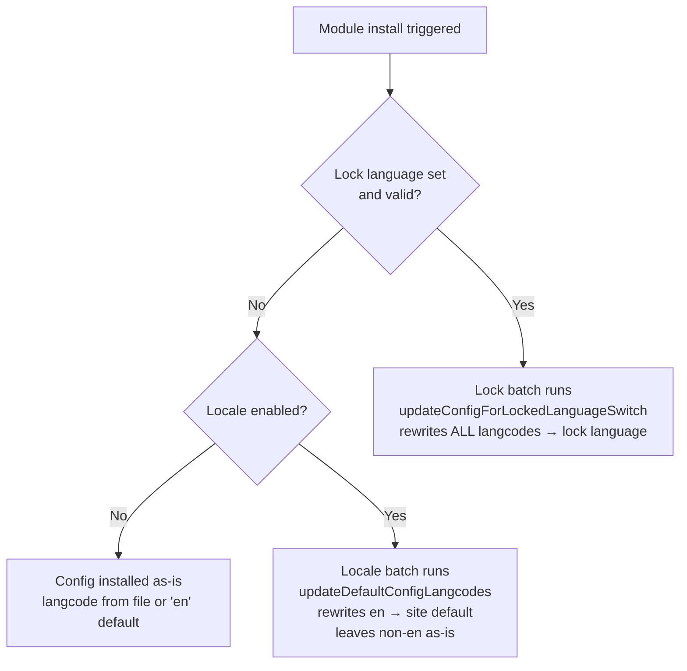

# Module install

When a module is installed via the UI (`admin/modules`), Drupal processes
a batch after the form submits. This page explains what langcode each installed
config object ends up with under the four relevant combinations of lock and
locale state.

## Outcome matrix

`always_valid` has the `FullyValidatable` schema marker; `maybe_invalid` does
not. Crucially, the **standard module installer does not run `FullyValidatable`
validation** after saving config — unlike `RecipeConfigInstaller`. This means
empty and invalid langcodes install without a 500 error in all no-lock scenarios.
In all locked scenarios the site default is `de` and the lock is `xx` to prove
the lock — not the site default — wins.

| Entity | Shipped langcode | No lock, no locale | No lock + locale (site default = de) | Lock = xx |
|---|---|---|---|---|
| `lock_ext_en` | `en` | `en` | `de` | `xx` |
| `lock_ext_missing` | _(none)_ | `en` | `de` | `xx` |
| `lock_ext_other` | `xx` | `xx` | `xx` | `xx` |
| `lock_ext_invalid` | `zz` | `zz` ⚠ | `zz` ⚠ | `xx` |
| `lock_ext_empty` | _(empty)_ | _(empty)_ ⚠ | `de` † | `xx` |
| `lock_ext_maybe_en` | `en` | `en` | `de` | `xx` |
| `lock_ext_maybe_missing` | _(none)_ | `en` | `de` | `xx` |
| `lock_ext_maybe_other` | `xx` | `xx` | `xx` | `xx` |
| `lock_ext_maybe_invalid` | `zz` | `zz` ⚠ | `zz` ⚠ | `xx` |
| `lock_ext_maybe_empty` | _(empty)_ | _(empty)_ ⚠ | `de` † | `xx` |

⚠ Invalid langcode silently persists — the standard module installer does not
run `FullyValidatable` validation and locale only rewrites exactly `en`, so
these bad values are never corrected without a lock.

† Empty langcode is treated as `en` by locale's `getDefaultConfigLangcode()`
(which normalizes empty to `'en'`), so it is rewritten to the site default just
like a shipped `en` langcode. The empty value does not survive.

The lock column applies identically with and without locale, because the lock
removes locale's `modules_installed` hook.

## Scenario details

### No lock, no locale

Drupal installs config exactly as shipped. No langcode rewriting takes place.
Even with the site default set to `de`, without locale enabled that default has
no effect on config langcodes.

| Entity | Shipped | Installed |
|---|---|---|
| `lock_ext_en` | `en` | `en` |
| `lock_ext_missing` | _(none)_ | `en` |
| `lock_ext_other` | `xx` | `xx` |
| `lock_ext_invalid` | `zz` | `zz` ⚠ |
| `lock_ext_empty` | _(empty)_ | _(empty)_ ⚠ |

⚠ Invalid or empty langcode silently persists — no validation runs on module install.

Same results for all `maybe_invalid` counterparts.

### No lock + locale enabled (site default = de)

Locale's `updateDefaultConfigLangcodes()` batch runs after install. It uses
`getDefaultConfigLangcode()` to determine the current langcode, which normalizes
an empty or missing value to `'en'`. It then rewrites any config whose resolved
langcode is `'en'` to the site default. Non-`en` langcodes (including unknown
codes) are left as-is.

| Entity | Shipped | Installed | Reason |
|---|---|---|---|
| `lock_ext_en` | `en` | `de` | `en` rewritten to site default |
| `lock_ext_missing` | _(none)_ | `de` | missing normalizes to `en`, then rewritten |
| `lock_ext_other` | `xx` | `xx` | not `en`, locale skips it |
| `lock_ext_invalid` | `zz` | `zz` ⚠ | not `en`, locale skips it |
| `lock_ext_empty` | _(empty)_ | `de` † | empty normalizes to `en`, then rewritten |

⚠ Invalid langcode silently persists — locale only rewrites exactly `en`.
† Empty langcode is normalized to `en` by `getDefaultConfigLangcode()` and then
rewritten to the site default.

Same results for all `maybe_invalid` counterparts.

### Lock = xx (with or without locale)

`hook_modules_installed` detects the lock, skips locale delegation, and queues
a rewrite batch. The batch calls `updateConfigForLockedLanguageSwitch()` which
sets `langcode` to `xx` on every config object that carries a `langcode` key,
regardless of its current value. This applies to both entity types equally.

| Entity | Shipped | Installed |
|---|---|---|
| `lock_ext_en` | `en` | `xx` |
| `lock_ext_missing` | _(none)_ | `xx` |
| `lock_ext_other` | `xx` | `xx` |
| `lock_ext_invalid` | `zz` | `xx` |
| `lock_ext_empty` | _(empty)_ | `xx` |

Same results for all `maybe_invalid` counterparts.

## Flow diagram

## Related pages

- [Theme install](theme-install.md) — same logic but with a batch-not-processed edge case
- [Lock switch lifecycle](lock-switch-lifecycle.md) — what happens when the lock language changes after install
- [Site default lifecycle](site-default-lifecycle.md) — how locale's behavior accumulates across multiple installs
- [Config actions](config-actions.md) — programmatic entity creation and its langcode behavior
