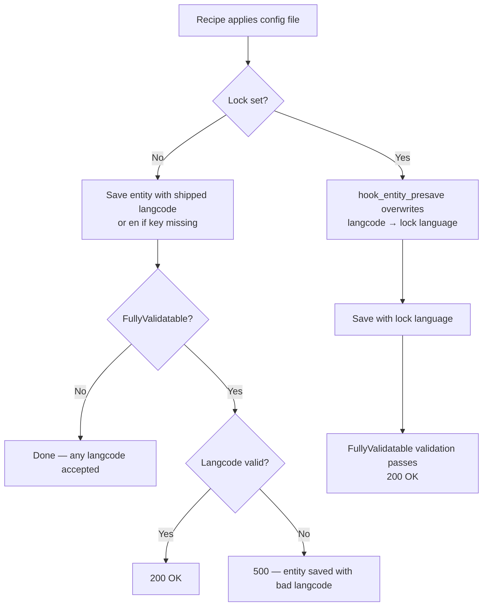

# Recipes

Recipes can introduce config in three ways: **direct config files** shipped in
the recipe's `config/` directory, **[config actions](config-actions.md)** that
create or update config entities at runtime, and **extension installs** via the
recipe's `install:` key. Config actions are covered in their own page; direct
config files and extension installs are covered here.

## Why two enforcement mechanisms are needed

Within a recipe, the lock enforces langcodes via two mechanisms with complementary scopes:

| Mechanism | Covers within a recipe | When it runs |
|---|---|---|
| `hook_entity_presave` | Config entities created by config actions at runtime; config entities from modules installed via `install:` (once eventually saved outside the syncing window) | At save time, before the entity is written to storage |
| `RecipeAppliedEvent` subscriber | Config files in the recipe's own `config/` directory | After the entire recipe has completed |

**Why presave alone is not enough for recipe `config/` files:**
When `RecipeRunner` installs modules listed in `install:`, it sets
`isSyncing=TRUE`, which causes `ConfigInstaller` to skip entity saves entirely
for those modules' config. Those entity configs are deferred and presave never
fires for them during the recipe. The subscriber covers the recipe's own
`config/` files after the fact.

For the recipe's own `config/` entities, presave does fire during
`RecipeConfigInstaller`'s `entity->save()` calls — so those entities are
normalized twice: once by presave at save time, and once by the subscriber via
a raw `configFactory->getEditable()->save()` after the recipe completes. The
double write is harmless (both write the same lock language), and unavoidable:
`hook_entity_presave` has no way to know it is running inside a recipe
application.

**Why the subscriber alone is not enough:**
The subscriber only reads the recipe's own `config/` directory — it does not
see config entities created at runtime by config actions, nor the deferred
entity config from `install:` modules. Those are handled exclusively by
`hook_entity_presave`.

## Direct config files

Config files in a recipe's `config/` directory are imported by
`RecipeConfigInstaller`. The installer saves all config first, then runs
`FullyValidatable` schema validation on entity types that opt in.

### How langcodes are determined without a lock

Direct config files are imported as-is. Whatever `langcode` value is in the
YAML file is what gets saved. A missing `langcode` key normalizes to the site
default language before the save.

Entity types that carry the `FullyValidatable` schema marker are validated after
being saved. An empty or unknown langcode will save successfully and then fail
validation — leaving the entity in the database with the bad langcode and
aborting the recipe with a 500 error.

Entity types without `FullyValidatable` are never validated; any langcode value
(including invalid ones) is accepted silently.

### How the lock changes this

When a lock is active, `hook_entity_presave` normalizes every config entity's
langcode to the lock language at save time — before `RecipeConfigInstaller`
runs its `FullyValidatable` validation. So even entities that shipped with an
invalid or empty langcode are saved with a valid langcode and validation passes.

After the recipe completes, the `RecipeAppliedEvent` subscriber performs a
second normalization pass over all recipe config names as a safety net,
calling `updateConfigForLockedLanguageSwitch()` on each one.

### Outcome matrix — direct config files

`always_valid` entities carry the `FullyValidatable` schema marker;
`maybe_invalid` entities do not. `RecipeConfigInstaller` runs `FullyValidatable`
validation after saving — so empty or unknown langcodes on `always_valid`
entities cause a 500 without a lock. `maybe_invalid` entities are never
validated, so any langcode is accepted silently.

All `maybe_invalid` entities are grouped in the valid-langcode recipe because
they never cause a validation error regardless of langcode value — there is no
`FullyValidatable` to trigger a 500. The empty and unknown recipes contain only
`always_valid` entities, where the 500 behavior is the point being tested.

| Entity | Type | Shipped langcode | No lock | Lock = `de` |
|---|---|---|---|---|
| `lock_recipe_request` | always_valid | `xx` (valid installed) | `xx` | `de` |
| `lock_recipe_other` | always_valid | `yy` (valid installed) | `yy` | `de` |
| `lock_recipe_missing` | always_valid | _(no key)_ | `en` (site default) | `de` |
| `lock_recipe_empty` | always_valid | _(empty)_ | _(empty)_ ⚠ then 500 ⚠ | `de`, 200 |
| `lock_recipe_unknown` | always_valid | `zz` (unknown lang) | `zz` ⚠ then 500 ⚠ | `de`, 200 |
| `lock_recipe_maybe_request` | maybe_invalid | `xx` (valid installed) | `xx` | `de` |
| `lock_recipe_maybe_other` | maybe_invalid | `yy` (valid installed) | `yy` | `de` |
| `lock_recipe_maybe_empty` | maybe_invalid | _(empty)_ | _(empty)_ ⚠ 200 | `de`, 200 |
| `lock_recipe_maybe_unknown` | maybe_invalid | `zz` (unknown lang) | `zz` ⚠ 200 | `de`, 200 |

⚠ Invalid or empty langcode persists in storage — either `FullyValidatable`
validation fires after the save and aborts with 500 (leaving the entity with the
bad langcode in the database), or `maybe_invalid` has no validation and the bad
value is silently accepted with 200.

## Extension config installed via a recipe

When a recipe's `install:` key causes a module to be installed, `RecipeRunner`
calls the standard `ModuleInstaller` with `config.installer->setSyncing(TRUE)`
active for the duration. This has two consequences:

- The standard `ConfigInstaller` is used (not `RecipeConfigInstaller`), so
  **`FullyValidatable` validation does not run** — the same as a standalone
  module install.
- The lock's `hook_modules_installed` implementation checks `$is_syncing` and
  **skips the rewrite batch** when syncing is true.

Despite the batch being skipped, the lock still normalizes langcodes because
`hook_entity_presave` fires on every `entity->save()` call inside
`ConfigInstaller::createConfiguration()`. Presave rewrites the langcode to the
lock language before the entity is written to storage, same as any other save.

Without a lock, locale's `hook_modules_installed` ignores `$is_syncing` and
queues its rewrite batch normally — the same batch that runs on a standalone
module install via the UI.

| Entity | Shipped langcode | No lock | Lock = `de` |
|---|---|---|---|
| `lock_recipe_ext_en` | `en` | `en` | `de` (via presave) |
| `lock_recipe_ext_missing` | _(no key)_ | `en` | `de` (via presave) |
| `lock_recipe_ext_xx` | `xx` | `xx` (valid installed) | `de` (via presave) |
| `lock_ext_invalid` | `zz` | `zz` ⚠ (no FullyValidatable check) | `de` (via presave) |

⚠ Invalid langcode silently persists — the standard module installer (used here
via the recipe's `install:` key) does not run `FullyValidatable` validation, so
the bad value is accepted with no error.

### Comparison: standalone vs recipe module install

| | Standalone module install | Recipe module install |
|---|---|---|
| `$is_syncing` passed to `hook_modules_installed` | `FALSE` | `TRUE` |
| Lock's rewrite batch runs | Yes | No — skipped because `$is_syncing` |
| Lock normalization still happens | Via batch | Via `hook_entity_presave` |
| Locale's rewrite batch runs | Yes | Yes — locale ignores `$is_syncing` |
| `FullyValidatable` validation runs | No | No |
| End result for langcodes | Same | Same |

## Config actions

Config actions inside recipes are handled the same way as standalone config
actions — see [Config actions](config-actions.md) for the full outcome matrix
and flow diagram. The short version: `hook_entity_presave` normalizes langcodes
at save time, and the `RecipeAppliedEvent` subscriber does **not** cover
action-created entities.

## Flow diagram — direct config file import

## Related pages

- [Config actions](config-actions.md) — full config action outcome matrix and flow diagram
- [Module install](module-install.md) — standalone module installs (outside of recipes)
- [UI forms](ui-forms.md) — form-based config entity creation
