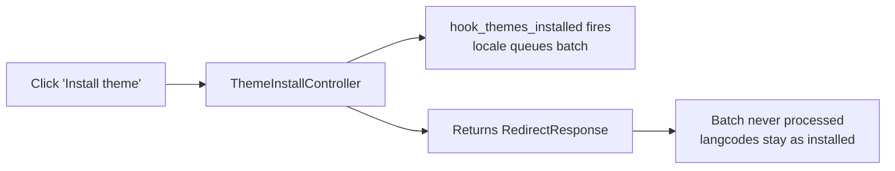
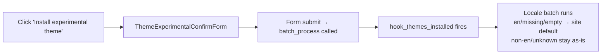

# Theme install

Theme installs follow the same lock-vs-locale logic as module installs but with
one important difference: **the standard theme install UI controller returns a
redirect without calling `batch_process()`**, so locale's rewrite batch is
queued but never executed on the non-experimental install path.

## Outcome matrix — standard theme

Includes both `lock_test_always_valid` (has `FullyValidatable` schema) and
`lock_test_maybe_invalid` (no `FullyValidatable`) entity types. The theme
installer does not run `FullyValidatable` validation, so invalid and empty
langcodes install without errors.

| Entity | Shipped langcode | No lock, no locale | No lock + locale (site default = de) | Lock = xx |
|---|---|---|---|---|
| `lock_theme_en` | `en` | `en` | `en` ⚠ | `xx` |
| `lock_theme_missing` | _(none)_ | `en` | `en` ⚠ | `xx` |
| `lock_theme_other` | `xx` | `xx` | `xx` ⚠ | `xx` |
| `lock_theme_invalid` | `zz` | `zz` † | `zz` ⚠† | `xx` |
| `lock_theme_empty` | _(empty)_ | _(empty)_ † | _(empty)_ ⚠† | `xx` |
| `lock_theme_maybe_en` | `en` | `en` | `en` ⚠ | `xx` |
| `lock_theme_maybe_missing` | _(none)_ | `en` | `en` ⚠ | `xx` |
| `lock_theme_maybe_other` | `xx` | `xx` | `xx` ⚠ | `xx` |
| `lock_theme_maybe_invalid` | `zz` | `zz` † | `zz` ⚠† | `xx` |
| `lock_theme_maybe_empty` | _(empty)_ | _(empty)_ † | _(empty)_ ⚠† | `xx` |

⚠ Despite locale being enabled and the site default being `de`, locale's batch
never processes on this install path — all langcodes stay exactly as installed.
The lock column applies both with and without locale (lock always wins).

† Invalid or empty langcode silently persists — the theme installer does not run
`FullyValidatable` validation, and on the standard install path locale's batch
never runs at all, so these bad values are never corrected without a lock.

## Outcome matrix — experimental theme with locale (site default = de)

The experimental theme uses a confirm form, so `batch_process()` is called and
locale's batch runs. Locale only rewrites `en`/missing to the site default;
non-en, invalid, and empty langcodes are left untouched.

| Entity | Shipped langcode | No lock + locale | Lock = xx + locale |
|---|---|---|---|
| `lock_theme_exp_en` | `en` | `de` | `xx` |
| `lock_theme_exp_missing` | _(none)_ | `de` | `xx` |
| `lock_theme_exp_other` | `xx` | `xx` | `xx` |
| `lock_theme_exp_invalid` | `zz` | `zz` † | `xx` |
| `lock_theme_exp_empty` | _(empty)_ | `de` ‡ | `xx` |

† Invalid langcode silently persists — locale only rewrites config whose
resolved langcode is `en`, so unknown codes are never corrected without a lock.

‡ Empty langcode is normalized to `en` by `getDefaultConfigLangcode()` and then
rewritten to the site default, same as a shipped `en` langcode.

## The batch-not-processed edge case

When a theme is installed via the Appearance UI (`admin/appearance → Install`),
the request goes to a controller that performs the install and then returns an
HTTP redirect. The redirect is sent before `batch_process()` is called, so
although `hook_themes_installed` queues the locale batch, it is never executed.

This is fundamentally different from the module install form, which is a
standard form submission — `FormSubmitter` calls `batch_process()` after submit
so the locale batch runs as expected.

### Experimental theme exception

Experimental themes go through `ThemeExperimentalConfirmForm` before install.
Because that is a real form submission, `FormSubmitter` calls `batch_process()`
and locale's batch runs normally — rewriting `en`/missing langcodes to the site
default, but leaving non-en, invalid, and empty langcodes untouched.

## Scenario details — standard theme

### No lock, no locale

Config is installed exactly as shipped. No rewriting of any kind.

| Entity | Shipped | Installed |
|---|---|---|
| `lock_theme_en` | `en` | `en` |
| `lock_theme_missing` | _(none)_ | `en` |
| `lock_theme_other` | `xx` | `xx` |
| `lock_theme_invalid` | `zz` | `zz` ⚠ |
| `lock_theme_empty` | _(empty)_ | _(empty)_ ⚠ |
| `lock_theme_maybe_en` | `en` | `en` |
| `lock_theme_maybe_missing` | _(none)_ | `en` |
| `lock_theme_maybe_other` | `xx` | `xx` |
| `lock_theme_maybe_invalid` | `zz` | `zz` ⚠ |
| `lock_theme_maybe_empty` | _(empty)_ | _(empty)_ ⚠ |

⚠ Invalid or empty langcode silently persists — no validation runs on theme install.

### No lock + locale enabled (site default = de)

Locale's batch is queued by `hook_themes_installed` but the redirect-based
controller never calls `batch_process()`. All langcodes remain exactly as
installed — locale does not get to rewrite anything, not even `en`.

| Entity | Shipped | Installed | Note |
|---|---|---|---|
| `lock_theme_en` | `en` | `en` | batch not processed |
| `lock_theme_missing` | _(none)_ | `en` | batch not processed |
| `lock_theme_other` | `xx` | `xx` | batch not processed |
| `lock_theme_invalid` | `zz` | `zz` ⚠ | batch not processed |
| `lock_theme_empty` | _(empty)_ | _(empty)_ ⚠ | batch not processed |
| `lock_theme_maybe_en` | `en` | `en` | batch not processed |
| `lock_theme_maybe_missing` | _(none)_ | `en` | batch not processed |
| `lock_theme_maybe_other` | `xx` | `xx` | batch not processed |
| `lock_theme_maybe_invalid` | `zz` | `zz` ⚠ | batch not processed |
| `lock_theme_maybe_empty` | _(empty)_ | _(empty)_ ⚠ | batch not processed |

⚠ Invalid or empty langcode silently persists — locale only rewrites exactly `en`, and the batch is not processed anyway on this install path.

### Lock = xx (no locale or with locale)

`hook_themes_installed` detects the lock and queues the lock's own rewrite
batch. Unlike the locale batch scenario, the lock batch is processed as part
of Drupal's standard batch continuation mechanism after the redirect. All
langcodes — including invalid and empty — are rewritten to the lock language.

With locale enabled, this module's `#[RemoveHook]` attribute removes locale's
`themes_installed` hook so locale never queues its own batch.

| Entity | Shipped | Installed |
|---|---|---|
| `lock_theme_en` | `en` | `xx` |
| `lock_theme_missing` | _(none)_ | `xx` |
| `lock_theme_other` | `xx` | `xx` |
| `lock_theme_invalid` | `zz` | `xx` |
| `lock_theme_empty` | _(empty)_ | `xx` |
| `lock_theme_maybe_en` | `en` | `xx` |
| `lock_theme_maybe_missing` | _(none)_ | `xx` |
| `lock_theme_maybe_other` | `xx` | `xx` |
| `lock_theme_maybe_invalid` | `zz` | `xx` |
| `lock_theme_maybe_empty` | _(empty)_ | `xx` |

## Config sync

Unlike `hook_modules_installed` (which receives an `$is_syncing` parameter),
`hook_themes_installed` does not. This module uses `ConfigInstallerInterface::isSyncing()`
to detect config sync and skip rewriting during that process, matching the
behavior of the module install hook.

## Related pages

- [Module install](module-install.md) — module installs where the batch always processes
- [Lock switch lifecycle](lock-switch-lifecycle.md) — rewriting existing config when the lock language changes
