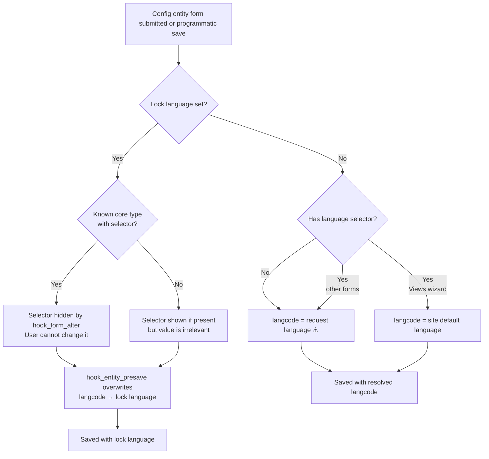

# UI forms

This page covers how config entity langcodes are determined when entities are
created or edited through the Drupal UI. For programmatic creation via config
actions, see [Config actions](config-actions.md).

## How Drupal determines langcode without a lock

Most config entity types have no language selector in their forms. The langcode
is simply set to the current request language at save time — whichever language
the admin interface was accessed in (typically determined by URL prefix
negotiation on multilingual sites). Content types are a representative example
of this majority case.

Four core config entity types expose a language selector in their forms:
`menu`, `date_format`, `taxonomy_vocabulary`, and `view`. For three of them the
selector defaults to the request language. Views is the exception:

- **Views add (wizard):** no language selector; `WizardPluginBase::instantiateView()`
  sets the langcode to `getDefaultLanguage()->getId()` — the site default
  language, not the request language.
- **Views edit-details form:** has a language selector that defaults to the
  request language.

| Form | Has selector | Langcode source (no lock) |
|---|---|---|
| Content type add / edit | No | Request language ⚠ |
| Most other config entities | No | Request language ⚠ |
| Menu add / edit | Yes | Request language ⚠ |
| Date format add / edit | Yes | Request language ⚠ |
| Vocabulary add / edit | Yes | Request language ⚠ |
| Views add (wizard) | No | Site default language |
| Views edit-details | Yes | Request language ⚠ |

⚠ The langcode silently follows whichever language the admin accessed the page
in. On a multilingual site with URL prefix negotiation, an admin visiting
`/xx/admin/…` unintentionally creates config with `langcode: xx`.

Contributed projects may ship config entity types that also expose language
selectors. This module does not know about those selectors and does not hide
them, but presave enforcement still applies — any save is overwritten to the
lock language regardless.

## How this module enforces the lock

When a lock language is configured:

1. **Language selector hidden** — `hook_form_alter` sets `#access = FALSE` on
   the `langcode` field for the four known core types: `menu`, `date_format`,
   `taxonomy_vocabulary`, and `view` (including the views edit-details form).
   This removes the selector so administrators cannot accidentally choose a
   different language.

2. **Presave enforcement** — `hook_entity_presave` overwrites the `langcode`
   on every config entity save, regardless of what the form or caller set. This
   is the final guarantee: it covers all entity types — including those with no
   selector, those with unknown contrib selectors, and any programmatic save
   that bypasses the form entirely.

## URL prefix scenarios — no lock

| URL prefix | Entity type | Saved langcode |
|---|---|---|
| `xx` | Content type (no selector) | `xx` ⚠ |
| `xx` | Menu | `xx` ⚠ |
| `xx` | Date format | `xx` ⚠ |
| `xx` | Vocabulary | `xx` ⚠ |
| `xx` | Views (add wizard) | site default (e.g. `en`) |
| `xx` | Views (edit-details) | `xx` ⚠ |

⚠ Langcode silently follows the request language — an admin visiting the page
under a different URL prefix unintentionally creates config in that language.

## URL prefix scenarios — lock = `de`

| URL prefix | Entity type | Saved langcode |
|---|---|---|
| `xx` | Content type | `de` |
| `xx` | Menu | `de` |
| `xx` | Date format | `de` |
| `xx` | Vocabulary | `de` |
| `xx` | Views (add wizard) | `de` |
| `xx` | Views (edit-details) | `de` |
| `yy` | Any | `de` |

## Related pages

- [Language management](language-management.md) — language deletion protection and stale lock handling
- [Config actions](config-actions.md) — programmatic entity creation via config actions
- [Recipes](recipes.md) — direct config files and extension config installed via recipes
- [Module install](module-install.md) — module install langcode behavior
