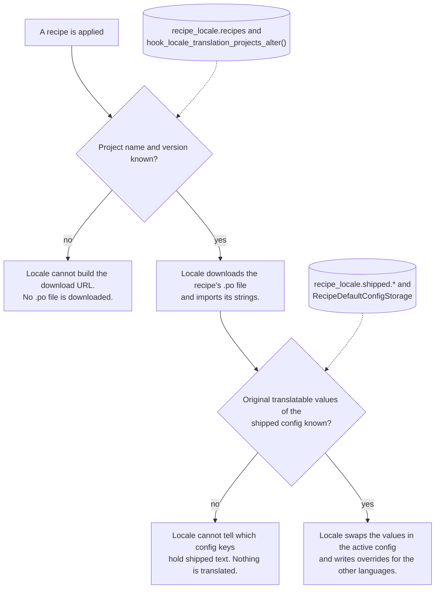

# Why track recipes at all

Recipes are supposed to be applied once and forgotten. They are supposed to be
automated site building steps as if someone manually did those steps and now
owns the result. Not something others would care to provide additional features
for!

On the other hand recipes are used in practice to deliver sizable packages of
preset features to sites, especially but not limited to in Drupal CMS.

## But, but, but recipes should not be tracked, by design!

I hear you. When the config sits in a module it gets automatically translated
on install and later when you add a new language you also get translations for
the module config then. For recipes this is not possible as-is. Guess what 
is the first missing piece? Yeah, tracking which recipes you had applied on
which versions.

## But, but, but there are already two modules tracking recipes!

**Project Browser** tracks recipes, but only collects the paths of recipes applied.
It does not track version information.  Also it only stores its list in a 
non-deployable state, which is environment specific so cannot be used as a
basis of interface translation.

**Recipe Tracker** tracks recipe application in its own log config entities. 
It does not support unpacked recipe version handling (which is only implemented
for now in Drupal CMS as a composer plugin). Also the config entity format is
much heavier than what we need for interface translation.

See also https://www.drupal.org/project/drupal/issues/3489066

## Locale integration needs even more data: default translatable config

Neither module stores what the translatable content of their config was, which
is the second must have for Locale integration. Otherwise Locale cannot
determine which keys to swap out in active config and generate config overrides
for. In other words, both of these other modules would need almost all of our
module added to support interface translation either way.

## How this module gives Locale what it needs for recipe translation

Locale can only translate the configuration of a recipe when it has two things,
and both have to stay around and deploy with the site, so the same process works
later when adding a new language or enabling translation or updating the 
translations on the UI. This module keeps the two things in configuration: the
first in `recipe_locale.recipes`, the second in `recipe_locale.shipped.*`.

Read the details on [how recording applied recipes](recording-recipes.md) and
[exposing them as translation projects](locale-projects.md) work which is the
first part of the solution. Also see how 
[the configuration recipes ship](shipped-config.md) is stored and exposed to
locale.

## Is this a lot of data to keep around though?

The module only stores the absolute minimal amount of information it needs to
operate. On sample Drupal CMS installs with the Haven and Dashi site templates,
the extra stored data is about 90KB, which is 6-7% of the configuration export,
altogether just 0.20% of the resulting database size on a fresh install. In both
cases this module exposes roughly 900 translatable strings to interface
translation which would otherwise be inaccessible to Drupal.

## What core could do instead

Most of what this module does is a workaround for two things core does not
keep by design: a list of applied recipes, and an original copy of the
configuration a recipe shipped that Locale can compare with. The core issue
for the version part, which Drupal CMS polyfills with the `version` key in
the recipe's `composer.json`, is
https://www.drupal.org/project/drupal/issues/3607162. The meta issue for
making recipes translatable is
https://www.drupal.org/project/drupal/issues/3488972.

While these are not done in core by design, these are also the two things that
interface translation needs from recipes to function.

Translating the input prompts and the config action values of a recipe is
planned in https://www.drupal.org/project/drupal/issues/3313863; this module
cannot do that part on its own, because it gets the recipe data processed,
too late to handle YAML tags.
